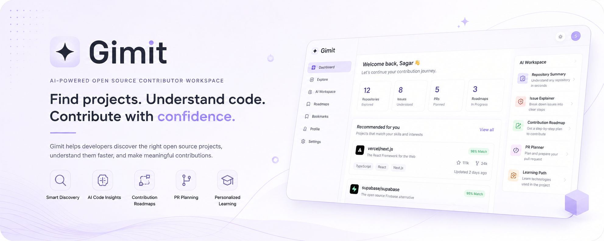

<p align="center">
  
</p>

<div align="center">

# Gimit

### AI-Powered Open Source Contributor Workspace

Helping developers discover, understand, and contribute to open-source projects through intelligent repository analysis and AI-assisted workflows.

<p align="center">


</p>

---

### Transforming contributor onboarding into an intelligent, AI-assisted experience.

<p>

⭐ Discover repositories tailored to your skills

⭐ Understand unfamiliar codebases instantly

⭐ Generate personalized contribution roadmaps

⭐ Plan pull requests with AI assistance

⭐ Learn faster. Contribute sooner.

</p>

</div>

---

# Why Gimit?

Open source has never lacked contributors.

It lacks efficient onboarding.

Every day, thousands of developers want to contribute to amazing projects, but most never make their first pull request.

Not because they aren't capable.

Because they struggle to answer questions like:

- Which repository should I contribute to?
- Which issue is right for me?
- How is this project structured?
- Where do I even begin?
- What should I learn before contributing?

Maintainers face the opposite challenge.

They repeatedly answer the same onboarding questions, explain project structure, review beginner pull requests, and guide contributors through identical setup steps.

The knowledge exists.

It simply doesn't scale.

---

# Our Solution

**Gimit** is an AI-powered contributor workspace that bridges the gap between contributors and maintainers.

Rather than switching between GitHub, documentation, tutorials, blog posts, and AI chatbots, developers receive everything they need from one unified workspace.

The platform combines:

- GitHub Profile Analysis
- Intelligent Repository Discovery
- AI Repository Understanding
- Issue Explanation
- Contribution Planning
- Pull Request Strategy
- Personalized Learning Guidance

into one seamless developer experience.

---

# Features

## GitHub Authentication

Secure GitHub OAuth integration allowing developers to instantly connect their profile and begin personalized exploration.

---

## Developer Profile Analysis

Analyze GitHub activity to understand:

- Languages
- Experience
- Interests
- Contribution history
- Technical strengths

---

## Intelligent Repository Discovery

Rather than randomly searching GitHub, Gimit recommends repositories using factors like:

- Skill compatibility
- Repository activity
- Community health
- Match confidence
- Repository quality

---

## Repository Explorer

Browse repositories with rich contextual information including:

- Description
- Languages
- Stars
- Forks
- Recent activity
- Contributor information

---

## AI Workspace

The heart of Gimit.

Generate:

- Repository Summaries
- Issue Explanations
- Contribution Roadmaps
- Pull Request Plans
- Learning Paths

without leaving the platform.

---

## Multi-AI Support

Built with a provider abstraction layer supporting:

- Google Gemini
- OpenAI
- Anthropic Claude

allowing developers to choose whichever model best suits their workflow.

---

# How It Works

```text
Developer
      │
      ▼
GitHub OAuth Authentication
      │
      ▼
Profile Analysis
      │
      ▼
Repository Matching
      │
      ▼
Repository Explorer
      │
      ▼
AI Workspace
      │
      ▼
Repository Summary
Issue Explanation
Roadmap
PR Planning
Learning Path
```

---

# Architecture

```text
┌──────────────────────────────┐
│          Frontend            │
│  Next.js + React + Tailwind  │
└──────────────┬───────────────┘
               │
               ▼
┌──────────────────────────────┐
│         API Routes           │
│ Authentication │ AI │ GitHub │
└──────────────┬───────────────┘
               │
               ▼
┌──────────────────────────────┐
│ GitHub Services │ AI Models  │
└──────────────────────────────┘
```

The architecture is intentionally modular, allowing future integration of multi-agent orchestration and Model Context Protocol (MCP) without significant restructuring.

---

# Technology Stack

## Frontend

- Next.js
- React
- TypeScript
- Tailwind CSS

## Backend

- Next.js API Routes
- GitHub OAuth
- Server-side APIs

## AI

- Google Gemini
- OpenAI
- Claude

## Development

- ESLint
- TypeScript
- Modular Architecture

---

# Project Structure

```bash
app/
components/
hooks/
lib/
public/
styles/
types/
```

Each module is organized around a single responsibility, making the project easier to maintain and extend.

---

# Getting Started

Clone the repository.

```bash
git clone https://github.com/notdoneyet-wq/Gimit.git
cd Gimit
```

Install dependencies.

```bash
npm install
```

Create an environment file.

```env
GITHUB_CLIENT_ID=

GITHUB_CLIENT_SECRET=

GEMINI_API_KEY=

OPENAI_API_KEY=

ANTHROPIC_API_KEY=
```

Run the development server.

```bash
npm run dev
```

Open:

```
http://localhost:3000
```

---

# Environment Variables

| Variable | Description |
|----------|-------------|
| GITHUB_CLIENT_ID | GitHub OAuth Client ID |
| GITHUB_CLIENT_SECRET | GitHub OAuth Client Secret |
| GEMINI_API_KEY | Google Gemini API Key |
| OPENAI_API_KEY | OpenAI API Key |
| ANTHROPIC_API_KEY | Claude API Key |

---

# Security

Security is treated as a core design principle.

Current implementation includes:

- GitHub OAuth
- Server-side authentication
- Secure environment variable management
- Backend request validation
- Modular API architecture

Future enhancements include:

- MCP Security Layer
- Rate Limiting
- Prompt Injection Protection
- Enhanced Session Security

---

# Roadmap

Upcoming improvements include:

- Google Agent Development Kit (ADK)
- Multi-Agent Architecture
- Model Context Protocol (MCP)
- Codebase Intelligence
- Automated Issue Matching
- Pull Request Review Assistance
- Repository Health Insights
- Enterprise Integrations

---

# Contributing

We welcome contributions from the community.

1. Fork the repository.
2. Create a feature branch.
3. Commit your changes.
4. Push to your fork.
5. Open a Pull Request.

---

# License

This project is licensed under the MIT License.

---

# Acknowledgements

Built using:

- Next.js
- React
- Tailwind CSS
- GitHub API
- Google Gemini
- OpenAI
- Anthropic Claude

---

<div align="center">

### Making open-source contribution more accessible, one developer at a time.

If you found this project interesting, consider ⭐ starring the repository.

</div>
